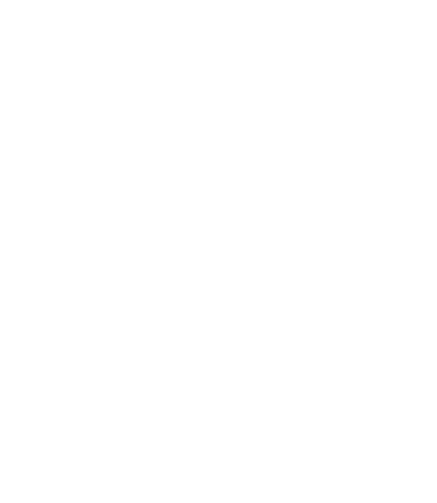

<p align="center">
  
</p>

<h1 align="center">Don't Crash Now!</h1>

<p align="center"><em>No vuelvas a perder 4 horas de trabajo... otra vez.</em></p>

<p align="center">Software libre y gratuito · Windows 10/11 · Licencia MIT</p>

**Don't Crash Now** (DCN) protege tu trabajo en programas de diseño, arte digital y 3D que se cuelgan, no tienen autoguardado o tienen uno poco fiable. Pulsa el atajo de guardado por ti en el momento oportuno, guarda un historial de versiones de tus archivos y te avisa si algo sale mal.

---

## Índice

- [Funciones](#funciones)
- [Instalación](#instalación)
- [Primeros pasos](#primeros-pasos)
- [Cómo funciona](#cómo-funciona)
- [Ajustes](#ajustes)
- [Dónde se guardan los datos](#dónde-se-guardan-los-datos)
- [Desarrollo](#desarrollo)
- [Arquitectura](#arquitectura)
- [Limitaciones conocidas](#limitaciones-conocidas)
- [Licencia y créditos](#licencia-y-créditos)

## Funciones

**Autoguardado por programa**
- Cada programa tiene su propio intervalo, atajo de guardado (`Ctrl+S`, `Ctrl+Alt+S`, `F2`...) y contador.
- Puedes añadir programas desde las ventanas abiertas, desde una lista de más de 20 programas populares (Blender, Krita, Photoshop, Clip Studio Paint, Aseprite, ZBrush, Maya...) o escribiendo el nombre del ejecutable.

**Guardado inteligente** (para no estropear un trazo)
- Espera a que hagas una pausa con el teclado, el ratón o el lápiz antes de guardar.
- Nunca guarda con un botón, `Shift`, `Ctrl`, `Alt` o `Espacio` presionados, así evita activar `Ctrl+Shift+S` («Guardar como») sin querer.
- No guarda documentos sin nombre, porque abriría «Guardar como» cada vez.
- No envía el atajo si hay un cuadro de diálogo abierto.
- Omite el guardado si el título indica que no hay cambios (la marca `*`).
- Detecta si el programa corre como administrador, porque en ese caso Windows bloquea las teclas.

**Respaldos con historial**
- Vigila las carpetas de proyecto y copia cada archivo guardado, con fecha y hora, a una carpeta de respaldos.
- Puedes limitar las versiones por archivo, el tiempo mínimo entre copias y el espacio máximo.
- Restaurar crea una copia junto al original y nunca lo sobrescribe.
- Verifica que cada guardado escribió realmente el archivo.

**Avisos y control**
- Notificaciones de Windows al guardar, ante problemas y opcionalmente unos segundos antes de guardar.
- El icono de la bandeja cambia de color según el estado (activo, en pausa, problema) y su menú permite activar, desactivar y pausar 15, 30 o 60 minutos.
- Atajo global (`Ctrl+Shift+Alt+F9` por defecto) para activar o desactivar desde cualquier programa.
- Detecta cierres inesperados (crashes) y te indica el último autoguardado y el último respaldo.

**Otros**
- Puede iniciar con Windows y arrancar en la bandeja.
- Solo se ejecuta una instancia a la vez.
- Estadísticas de guardados, respaldos y tiempo protegido, con un registro de actividad.
- Interfaz en español e inglés.

## Instalación

Descarga el instalador (`.exe` o `.msi`) desde la página de [Releases](https://github.com/SecretCodeLabb/work-saver/releases) y ejecútalo. Requiere Windows 10 u 11; WebView2 viene incluido en Windows 11 y el instalador lo añade en Windows 10 si falta.

## Primeros pasos

1. Abre **Don't Crash Now** y ve a **Programas → Añadir programa**.
2. Elige tu programa en *Abiertos ahora* o en *Populares*.
3. Despliega el programa y revisa el **intervalo** y el **atajo de guardado** (casi siempre `Ctrl+S`).
4. *(Recomendado)* En **Carpetas de proyecto**, añade la carpeta donde guardas tus archivos para activar los respaldos y la verificación.
5. Vuelve a **Inicio** y activa el interruptor.
6. Guarda tu documento manualmente una vez, para que tenga nombre.

Al cerrar la ventana, DCN sigue funcionando en la bandeja del sistema. Para salir del todo, usa **Salir** en el menú del icono.

## Cómo funciona

```
cada segundo
 └─ ¿el autoguardado está activo y sin pausa?
     └─ ¿la ventana activa pertenece a un programa vigilado?
         └─ ¿ya pasó su intervalo?
             ├─ documento sin nombre / programa como administrador → esperar y avisar
             ├─ el título indica que no hay cambios               → omitir y reiniciar el contador
             ├─ diálogo abierto o teclas/botones presionados       → esperar
             ├─ el usuario está activo (y no se superó la espera máxima) → esperar una pausa
             ├─ aviso previo activado                              → notificar y esperar N segundos
             └─ enviar el atajo → reiniciar el contador → esperar el archivo en disco
                                                              ├─ aparece → verificado + respaldo
                                                              └─ no aparece (había cambios) → avisar
```

La marca de cambios (`*`) solo se tiene en cuenta si el programa la ha mostrado alguna vez. Así, en programas que no la muestran nunca se deja de guardar.

## Ajustes

| Sección | Opciones |
|---|---|
| Guardado inteligente | Esperar una pausa (segundos), espera máxima, guardar solo con cambios, omitir documentos sin nombre, omitir si hay diálogos |
| Respaldos | Activar, carpeta, versiones por archivo, minutos entre copias, espacio máximo |
| Notificaciones | Al guardar, problemas, aviso previo (segundos), sonido |
| Inicio | Iniciar con Windows, iniciar en la bandeja |
| Atajo global | Combinación para activar o desactivar (o ninguna) |
| Idioma | Automático, español, inglés |

Por programa: nombre, ejecutable, intervalo, atajo, extensiones de archivo, carpetas de proyecto, marcas de «sin nombre» y marcas de «cambios sin guardar».

## Dónde se guardan los datos

| Qué | Ruta |
|---|---|
| Configuración | `%APPDATA%\com.dxnx3d.dontcrashnow\config.json` |
| Respaldos (predeterminado) | `%APPDATA%\com.dxnx3d.dontcrashnow\backups\` |
| Índice de respaldos | `%APPDATA%\com.dxnx3d.dontcrashnow\backups.json` |
| Estadísticas | `%APPDATA%\com.dxnx3d.dontcrashnow\activity.json` |
| Registro | `%LOCALAPPDATA%\com.dxnx3d.dontcrashnow\logs\activity.log` |

DCN no envía nada a internet.

## Desarrollo

Requisitos: [Node.js](https://nodejs.org/) 18 o superior, [Rust](https://rustup.rs/) estable (toolchain MSVC) y los [prerrequisitos de Tauri](https://tauri.app/start/prerequisites/).

```bash
npm install            # dependencias del frontend
npm run tauri dev      # app en modo desarrollo
npm run tauri build    # instaladores en src-tauri/target/release/bundle/
cd src-tauri && cargo test   # pruebas del backend
```

**Diagnóstico:** con la variable de entorno `DCN_TRACE=1`, el planificador imprime en consola cada ciclo: ventana activa, perfil detectado, tiempo restante, decisión y si se envió el atajo.

```bash
DCN_TRACE=1 src-tauri/target/debug/dont-crash-now.exe
```

**Publicar una versión:** actualiza la versión en `package.json`, `src-tauri/Cargo.toml` y `src-tauri/tauri.conf.json`, y sube una etiqueta `vX.Y.Z`. GitHub Actions compila los instaladores y crea un borrador de release.

## Arquitectura

Es una app [Tauri 2](https://tauri.app/). El backend en Rust hace el trabajo con la API de Windows y el frontend en TypeScript (sin framework, con Vite) es el panel de control.

```
src-tauri/src/
├── lib.rs        Arranque: plugins, estado, hilos, bandeja y comandos
├── config.rs     Configuración (perfiles, guardado inteligente, respaldos...) y su persistencia
├── state.rs      Estado compartido y la instantánea «status» que recibe la interfaz
├── scheduler.rs  Hilo principal: decide cuándo y si se guarda (guardado inteligente)
├── backup.rs     Vigilancia de carpetas, respaldos, restauración y verificación
├── crash.rs      Detección de cierres inesperados por código de salida
├── activity.rs   Estadísticas diarias y registro de actividad
├── actions.rs    Cambios de configuración desde la bandeja o el atajo, y notificaciones
├── tray.rs       Icono con estados y menú de la bandeja
├── win32.rs      Ventana activa, procesos, inactividad, teclas, elevación (API Win32)
├── shortcut.rs   «Ctrl+Shift+S» ↔ códigos de tecla virtual
├── presets.rs    Programas populares con sus extensiones
├── texts.rs      Textos del backend (ES/EN)
└── commands.rs   Comandos IPC

src/
├── main.ts       Navegación y avisos globales
├── api.ts        Tipos y llamadas al backend
├── store.ts      Configuración y estado en la interfaz
├── i18n/         Textos ES/EN y formatos
├── ui/           Componentes (dom.ts), iconos y grabador de atajos
└── views/        Inicio, Programas, Respaldos, Actividad, Ajustes
```

**Comunicación:** la interfaz llama a comandos (`get_config`, `set_config`, `pause`, `list_backups`, `restore_backup`, `get_activity`...) y escucha eventos del backend:

| Evento | Cuándo |
|---|---|
| `status` | Cada segundo: contadores, ventana activa, motivos de espera, último guardado y cierre inesperado |
| `config_changed` | La configuración cambió desde la bandeja, el atajo o al terminar una pausa |
| `saved` | Se envió un atajo de guardado |
| `save_verified` / `save_unverified` | Se confirmó, o no, el archivo guardado |
| `backup_created` | Se creó un respaldo |
| `crash_detected` | Un programa vigilado se cerró inesperadamente |
| `activity` | Hay un nuevo evento en el registro |

## Limitaciones conocidas

- **Solo Windows.** Usa la API Win32 para detectar ventanas y enviar teclas.
- La detección de «sin nombre» y de «cambios sin guardar» se basa en el título de la ventana, que varía según el programa y su versión. Las marcas se pueden ajustar por programa.
- Los respaldos y la verificación requieren indicar las carpetas de proyecto y las extensiones.
- Para enviar teclas a un programa que corre como administrador, DCN también debe ejecutarse como administrador.
- Un cierre forzado desde el Administrador de tareas también cuenta como cierre inesperado.
- El ejecutable no está firmado digitalmente, así que SmartScreen o algunos antivirus pueden mostrar un aviso, porque la app simula pulsaciones de teclado.

## Licencia y créditos

Don't Crash Now es **software libre y gratuito** bajo licencia [MIT](LICENSE). Puedes usarlo, estudiarlo, modificarlo y compartirlo.

Desarrollado por **DXNX.3D**: [GitHub](https://github.com/SecretCodeLabb) · [Instagram](https://www.instagram.com/dxnx.3d/) · [ArtStation](https://www.artstation.com/danimation21)

Construido con [Tauri](https://tauri.app/), [Rust](https://www.rust-lang.org/), [TypeScript](https://www.typescriptlang.org/) y [Vite](https://vitejs.dev/).
